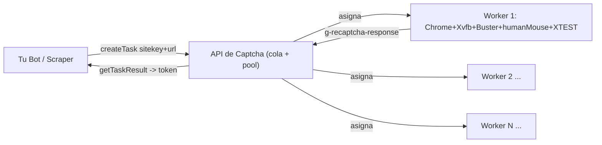

# Implementación futura: API propia de tokens de captcha (Token Farm)

Diseño para evolucionar el solver actual hacia una **API interna de resolución de captchas**
— tu propio "Capsolver" self-hosted. Documento de roadmap; **hoy estamos armando infra**, esto
es la meta hacia donde crece.

> **Por qué:** ya rechazamos Capsolver (costo). Ya resolvemos reCAPTCHA de forma estable con
> infra propia. El siguiente paso natural es **generalizar** ese solver para que cualquier bot
> propio le pida tokens por API, en vez de tener la lógica de captcha acoplada a cada scraper.

---

## 1. El principio (lo que descubrimos, y en lo que se basa todo)

**reCAPTCHA v2/v3 NO es un ban binario: es un puntaje de riesgo ponderado.**

- Cada señal suma o resta "peso" a un score. Google no dice "sos un bot / no sos un bot";
  dice "**qué tan probable es que seas un bot**".
- El mensaje de **"IP baneada" es engañoso** — no te banean la IP, te asignan un **risk score
  alto**. Con la misma IP, si bajás el score, pasás (se comprobó: por VNC con mouse real pasaba,
  por robot no — misma IP).
- Cada capa humana **baja el peso**:

| Señal | Peso que aporta |
|---|---|
| `humanMouse.ts` moviendo el cursor de fondo | mouse "vivo" → baja el score |
| Extensión Buster decidiendo/resolviendo | comportamiento coherente |
| Client app nativo (XTEST) ejecutando el input | `isTrusted=true`, input real del OS |
| Perfil persistente + cookies + flags anti-automatización | reputación del browser |
| IP con peso bajo (residencial/móvil > datacenter) | reputación de red |

La suma de señales bajas → *"se ve sospechoso, pero es comportamiento humano → pasás"*. Esa
frase es, literalmente, el modelo mental correcto de reCAPTCHA.

---

## 2. Arquitectura objetivo (tu diagrama)

```
[Tu Bot] ──1. Envía SiteKey + URL──▶ [API de Captcha] ──2. Asigna a worker (browser+Buster)
   ▲                                                                    │
   │                                                                    ▼
[Tu Bot] ◀─4. Devuelve Token resuelto─ [API de Captcha] ◀─3. Obtiene g-recaptcha-response
```

Es el patrón clásico de 2captcha / Anti-Captcha / Capsolver, pero **con tus propios workers**.
Reemplaza al proveedor pago por un **farm de navegadores** que ya sabés humanizar.



---

## 3. Cómo se construye SOBRE lo que ya tenés

El `server.ts` **ya mantiene un pool de tokens** (`POOL_TARGET=6`, workers resolviendo en
background). Eso ya ES el motor de esta API. Lo que falta es **desacoplarlo** del sitio de
policía y exponerlo genérico:

| Hoy (acoplado) | Futuro (API genérica) |
|---|---|
| El solver navega SIEMPRE al sitio de policía (hardcode) | Recibe `websiteURL` + `websiteKey` por parámetro |
| El token se usa internamente en la consulta | El token se **devuelve** al cliente por API |
| Un pool para un solo sitio | Pools por `(sitekey, dominio)` |
| `POST /consultar` | `POST /createTask` + `GET /getTaskResult` |

**Trabajo concreto:** extraer `resolverCaptcha()` a un módulo `solver/` que tome
`(page, sitekey, url)`, y montar una cola de tareas que asigne a los workers libres del pool
(la lógica rodante de workers que ya diseñamos en el plan del lote sirve tal cual).

---

## 4. Contrato de API propuesto (compatible-ish con Anti-Captcha/2captcha)

Reusar el formato de los proveedores conocidos → los clientes existentes casi no cambian.

```http
POST /createTask
{ "type": "RecaptchaV2TaskProxyless",
  "websiteURL": "https://antecedentes.policia.gov.co:7005/WebJudicial/index.xhtml",
  "websiteKey": "6LcsIwQaAAAAAFCsaI-dkR6hgKsZwwJRsmE0tIJH" }
→ { "taskId": "abc123" }
```
```http
GET /getTaskResult?taskId=abc123
→ { "status": "processing" }                # todavía resolviendo
→ { "status": "ready", "solution": { "gRecaptchaResponse": "03AGdBq26..." } }
```

Auth por **API key** propia (header). Rate limit por key. Métricas de éxito/tiempo por sitekey.

---

## 5. Consumo del token (el "paso 4": engañar al servidor con el token)

Cuando el farm entrega el `gRecaptchaResponse`, el bot tiene que **inyectarlo y consumirlo**
antes de que expire (~120s, un solo uso). En navegación normal, al resolver el captcha, Google
inyecta ese token en el campo oculto `<textarea id="g-recaptcha-response">` del form. El bot
simula eso. Hay dos formas:

### Flavor A — automatización de navegador (inyectar + disparar callback + submit)
El textarea está oculto (`display:none`); hay que escribirlo y —clave— **invocar el callback**
que reCAPTCHA normalmente llama, porque muchos formularios NO leen el textarea directo:

```js
// Playwright / Puppeteer — en la página objetivo ya cargada
await page.evaluate((token) => {
  const ta = document.getElementById('g-recaptcha-response');
  ta.style.display = 'block';
  ta.value = token;                                    // 1) inyectar el token

  // 2) disparar el callback si el form lo usa (si no, el submit sigue deshabilitado)
  const w = document.querySelector('.g-recaptcha');
  const cb = w && w.getAttribute('data-callback');
  if (cb && typeof window[cb] === 'function') window[cb](token);
}, token);
await page.click('#submitBtn');                        // 3) submit
```

### Flavor B — HTTP puro (sin navegador en el bot) ← el que escala
Si conocés la petición POST del form, **te saltás el navegador entero** en el consumidor:
mandás el token como un campo más. Esto es lo que hace la infra "seria" a volumen.

```python
import requests
# token viene de tu API:  getTaskResult -> solution.gRecaptchaResponse
r = requests.post(
    "https://sitio-objetivo/formulario",
    data={
        "campo_cedula": "1007601007",
        "g-recaptcha-response": token,     # <-- el token va como un campo del form
        # ...resto de campos ocultos (viewstate JSF, csrf, etc.)
    },
    headers={"Referer": "https://sitio-objetivo/...", "User-Agent": "..."},
)
```

### Lo que hace el server objetivo (por qué funciona)
El server toma ese `g-recaptcha-response` y le pregunta a Google:
```
POST https://www.google.com/recaptcha/api/siteverify
     secret=<SECRET_del_sitio>&response=<token>
→ { "success": true, "hostname": "antecedentes.policia.gov.co", "challenge_ts": "..." }
```
Google responde *"sí, un humano lo resolvió hace 5s"* y **el server te deja pasar sin saber que
se resolvió en otra máquina**. Ese es todo el truco.

### Los 3 gotchas que hacen fallar esto (no los saltees)
1. **Dominio (el make-or-break):** `siteverify` devuelve el `hostname` donde se resolvió. Si el
   sitio valida origen, un token de otra máquina **se rechaza**. → el farm quizá deba resolver en
   el **dominio real** (no en cualquier página). Detalle en §7. Se prueba por sitekey.
2. **Callback:** inyectar el textarea a veces no basta; hay que **disparar el `data-callback`**
   o el front nunca habilita el submit.
3. **TTL / single-use:** el token vive **~120s** y se usa **una sola vez**. Entregarlo fresco y
   consumirlo ya (no encolarlo).

---

## 6. El "solver farm" (los workers)

- N navegadores idénticos al actual: **Chrome + Xvfb + Buster (con client app) + humanMouse**.
- Cada worker toma una tarea, navega a `websiteURL`, resuelve el reCAPTCHA con las capas
  humanas, **extrae el `g-recaptcha-response`** (del textarea `#g-recaptcha-response` o vía
  el callback) y lo entrega a la cola.
- **Gestión de risk score** = el corazón del negocio:
  - Pool de **IPs** (residencial/móvil pesa menos que datacenter). Rotar y "enfriar" las que
    acumulan peso alto (el `rpa-proxy-watchdog` ya hace la primera versión de esto).
  - Throttle por IP (no 6 solves simultáneos desde la misma IP).
  - Perfiles persistentes por worker (reputación acumulada).

---

## 7. Límites honestos (para no diseñar sobre un mito)

- **El token está atado al dominio.** Un `g-recaptcha-response` se valida server-side con el
  *secret key* del dueño del sitio (`siteverify`). Si el sitio tiene activada la **verificación
  de dominio/origen**, el token debe resolverse en un contexto que Google asocie a ese dominio
  → el worker debe cargar el **sitio real** (o un harness con el referer correcto). Muchos sitios
  la tienen **desactivada** y ahí un token resuelto "remoto" es aceptado. **Hay que probarlo por
  sitekey** — no asumir que un token de cualquier lado sirve.
- **reCAPTCHA v3 es distinto:** no hay challenge, es **puro score** generado con la acción. No
  se "resuelve" con un click; depende de la **reputación acumulada** (browser/IP/cookies/historial).
  Este farm resuelve muy bien **v2 (checkbox + challenge)**; para v3 la estrategia es mantener
  browsers "con reputación" (uso real, cookies, edad), no resolver un puzzle.
- **Enterprise vs normal:** el sitio de policía usa reCAPTCHA **Enterprise**; el flujo de token
  es el mismo, pero el score puede ponderar más señales. Nuestra config ya lo pasa.
- **Uso:** esto es para **tu propia infra** de consultas a servicios públicos (antecedentes),
  no un servicio abierto a terceros. Mantenerlo interno y autenticado.

---

## 8. Roadmap por fases

- **Fase 0 — hoy ✅:** pool de tokens acoplado al sitio de policía, estable 5/5. (`server.ts`)
- **Fase 1:** extraer `resolverCaptcha()` a `solver/` genérico `(page, sitekey, url)`.
- **Fase 2:** API `createTask` / `getTaskResult` + cola de tareas + auth por API key.
- **Fase 3:** farm multi-worker + **multi-IP** (pool de proxies residencial/móvil), con métricas
  de éxito y risk score por IP/sitekey.
- **Fase 4:** dashboard de operación (éxito %, tiempo medio, IPs "quemadas"), rate limiting,
  auto-scaling de workers.

---

## 9. Piezas que YA existen y se reusan

| Pieza actual | Rol en la API futura |
|---|---|
| Pool de tokens de `server.ts` | motor de resolución (Fase 1) |
| `helpers/humanMouse.ts` | capa humana de cada worker |
| `deploy/install_buster_client.sh` + native host | input real (XTEST) de cada worker |
| `rpa-proxy-watchdog` + `hide-my-ip` | gestión de IP / risk score (v1) |
| systemd 24/7 (`deploy/`) | mantener el farm arriba |
| `transcribe.py` (whisper local) | audio challenge sin depender de remoto |

**No arrancás de cero.** La infra que armamos para el RPA de antecedentes **es** el prototipo
de esta API — solo hay que generalizarla y exponerla. Ver `ANTIBAN_VPS.md` para el detalle de
cada capa.
